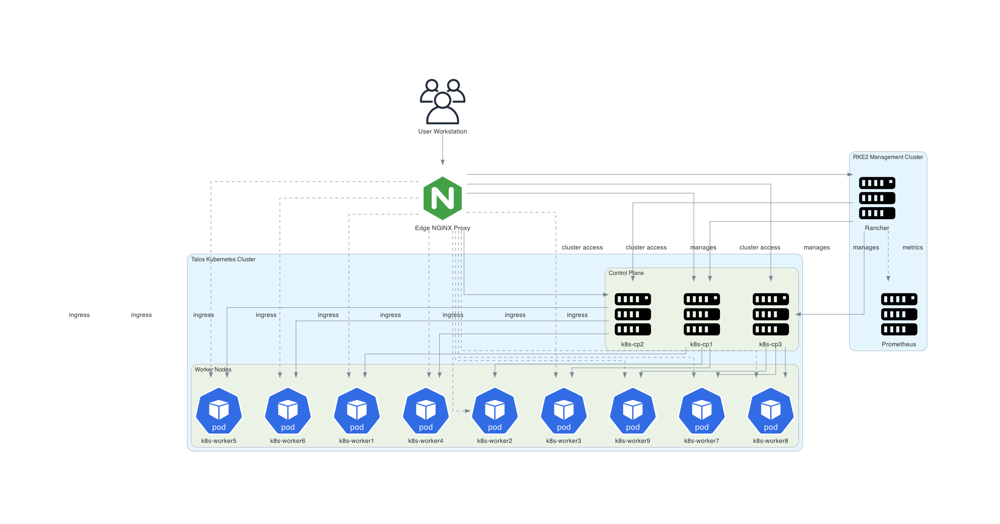

## Cluster Topology

The cluster topology is designed to clearly separate management and workload responsibilities while maintaining a controlled access path through the edge layer.

At the entry point, user traffic originates from the workstation and is routed through the **NGINX edge proxy**, which acts as the centralized ingress gateway. This ensures consistent routing, access control, and abstraction of backend services.

The infrastructure is logically divided into two primary layers:

### Management Cluster (RKE2)
- Hosts **Rancher** for centralized Kubernetes management
- Runs monitoring components such as **Prometheus**
- Operates independently from workload traffic
- Provides administrative control over the entire environment

### Workload Cluster (Talos Kubernetes)
- Runs application workloads and platform services
- Built on an immutable OS (Talos) for improved security and consistency
- Scales horizontally via worker nodes
- Receives traffic only through controlled ingress paths

This separation ensures:
- Isolation between management and application workloads
- Improved security posture
- Easier upgrades and operational control
- Reduced blast radius in case of failures

---

### Diagram

