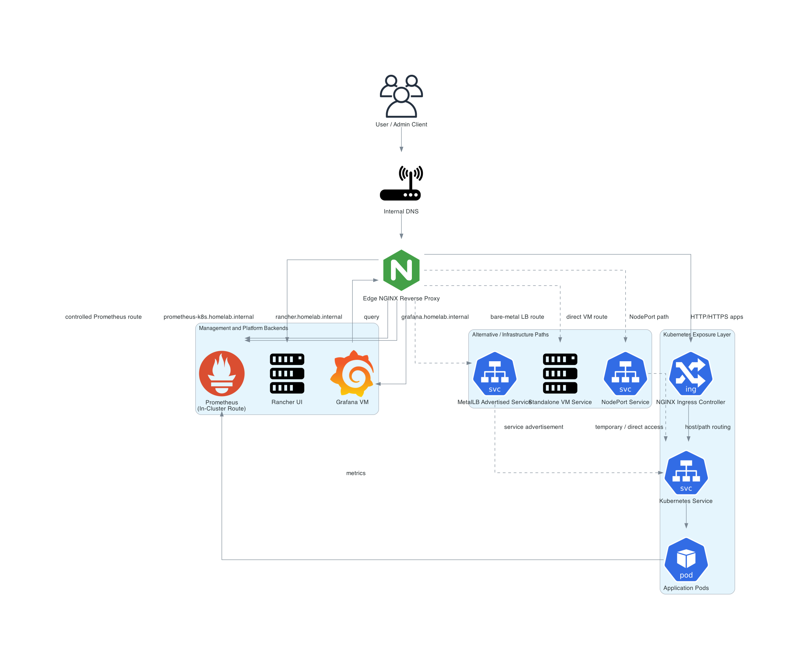

# Network Flow

## Purpose

This document explains how traffic moves through the Kubernetes HA homelab platform, from internal users to exposed services, management endpoints, and observability components.

The platform is built around four logical layers:

1. Client and DNS resolution layer
2. Edge access and reverse proxy layer
3. Kubernetes ingress and service layer
4. Platform and observability backends

This matches the repository architecture, where service access is centralized through an edge proxy, internal DNS provides stable naming, Kubernetes services are exposed through MetalLB and NGINX Ingress, and observability is split between in-cluster Prometheus and external Grafana. :contentReference[oaicite:1]{index=1}

---

## Traffic Path

