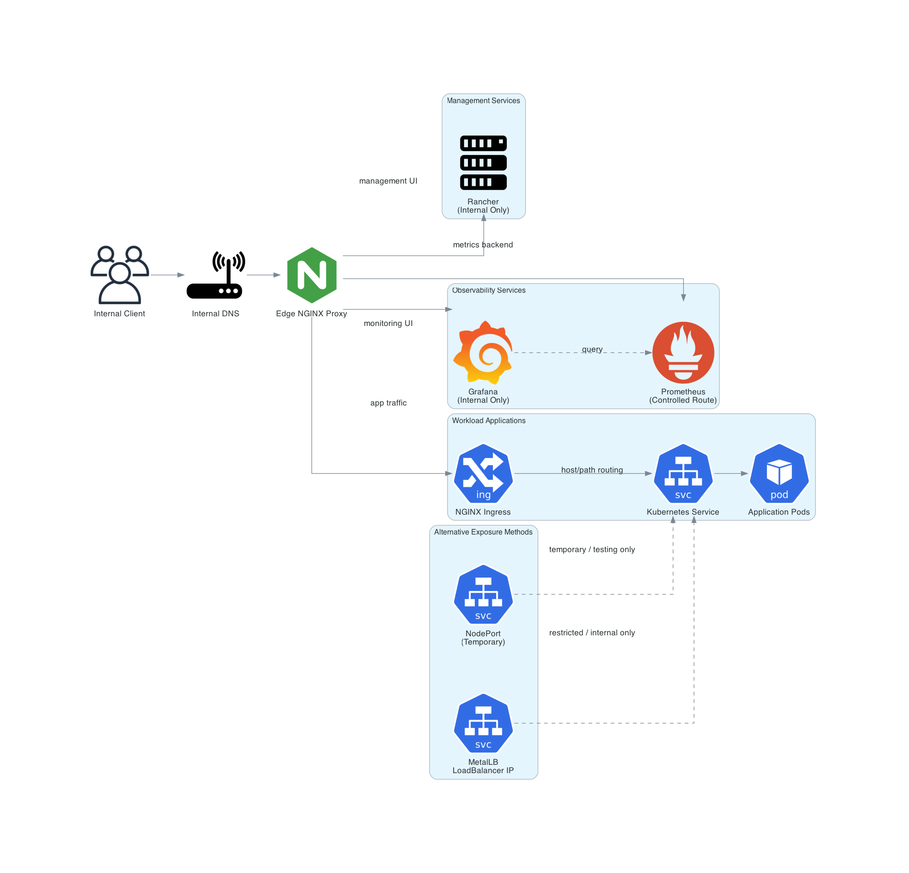

## Service Exposure

Service exposure in the cluster follows a layered ingress architecture to ensure controlled, secure, and observable access to applications.

Traffic is never routed directly to worker nodes or pods. Instead, it flows through multiple abstraction layers that enforce routing policies, DNS resolution, and ingress control.

---

## Traffic Flow

1. **User**
   - Initiates request via browser or API client

2. **Domain (app.homelab.internal)**
   - Resolved via internal DNS

3. **Internal DNS**
   - Maps domain to edge proxy IP

4. **Edge Proxy (NGINX)**
   - Central entry point
   - Handles routing and optional TLS termination

5. **NGINX Ingress Controller**
   - Kubernetes-native routing layer
   - Maps requests to services

6. **Kubernetes Service**
   - Provides stable access (ClusterIP/NodePort/LoadBalancer)
   - Load balances traffic

7. **Application Pods**
   - Run on worker nodes
   - Serve application logic

---

## Diagram

---

## Key Characteristics

- No direct exposure of nodes or pods
- Centralized ingress via NGINX
- DNS-based service access
- Decoupled routing and workload layers
- Scalable backend without changing entry points

---

## Benefits

- Reduced attack surface
- Clean internal domain structure
- Consistent routing and access control
- Easier observability and debugging
- Production-aligned architecture