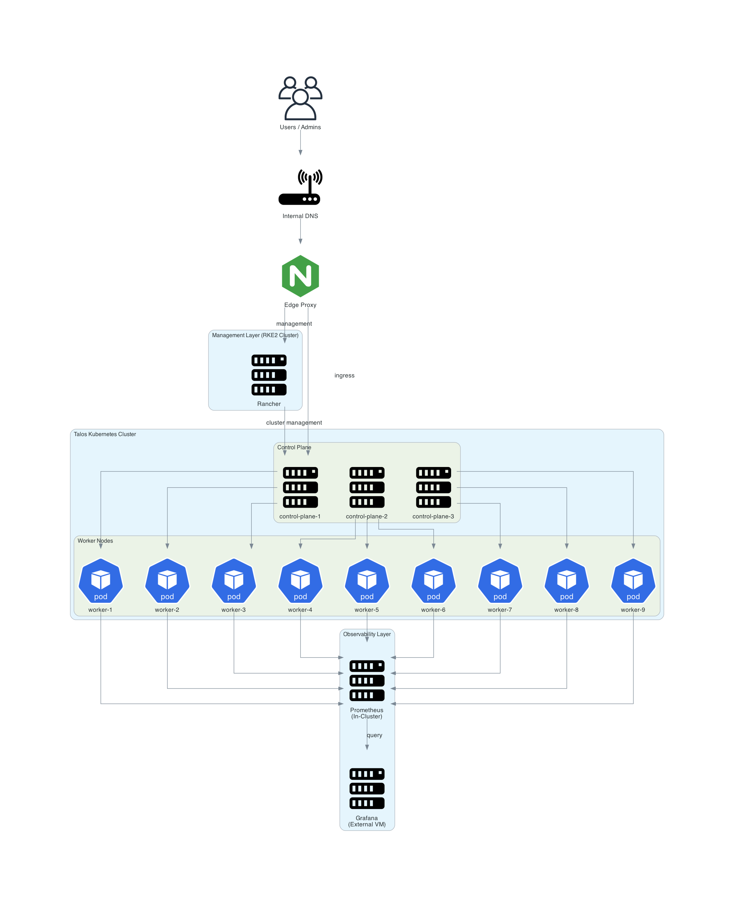
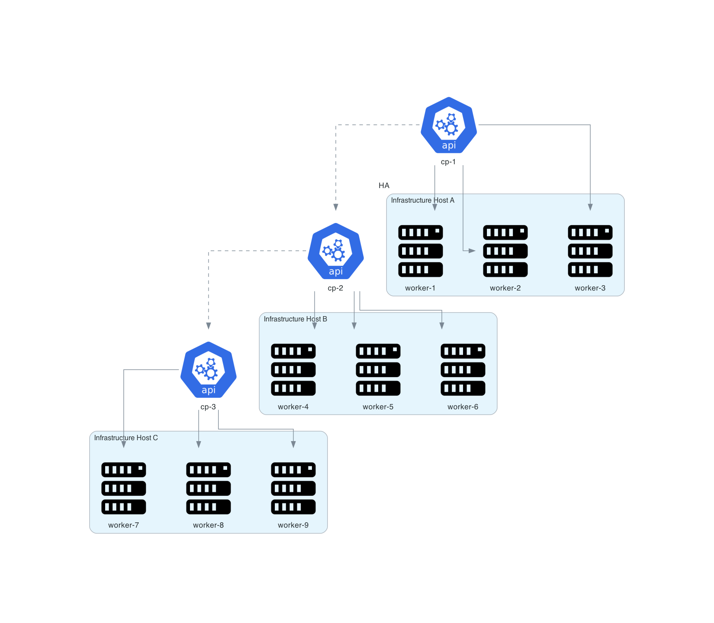

# Architecture Overview

## Objective

The platform is designed as a production-style homelab Kubernetes environment with separation between:

- management plane
- workload plane
- ingress and service exposure
- observability stack

---
# Platform Components

## Control Plane

Three control plane nodes maintain cluster state and scheduling.

| Node | Role |
|----|----|
| control-plane-1 | API server |
| control-plane-2 | scheduler |
| control-plane-3 | controller manager |

---

## Worker Nodes

Worker nodes run container workloads.

| Node | Role |
|----|----|
| worker-1 | compute |
| worker-2 | compute |
| worker-3 | compute |
| worker-4 | compute |
| worker-5 | compute |
| worker-6 | compute |

---

# Supporting Infrastructure

| Component | Purpose |
|----------|--------|
| Rancher | cluster management |
| Prometheus | metrics collection |
| Grafana | metrics visualization |
| Edge Proxy | ingress routing |

---

## Design Principles

- Immutable node OS with Talos
- Separate Rancher management cluster
- Bare-metal service exposure using MetalLB
- Ingress-based application routing
- External Grafana as central observability UI
- Internal DNS for stable service naming

---

## Diagram 

___

## Cluster Layers

### Management Layer
RKE2-based management cluster hosting Rancher and cluster-level management services.

### Workload Layer
Talos-based Kubernetes cluster hosting applications and platform services.

### Access Layer
NGINX edge proxy and internal DNS server for standardized service entry points.

### Observability Layer
Rancher Monitoring Prometheus plus external Grafana integration.

---

# Availability Model

The cluster distributes nodes across multiple infrastructure hosts to prevent single point failures.

## Diagram

---

## Benefits

- easier upgrades
- cleaner operations
- better fault isolation
- realistic enterprise architecture