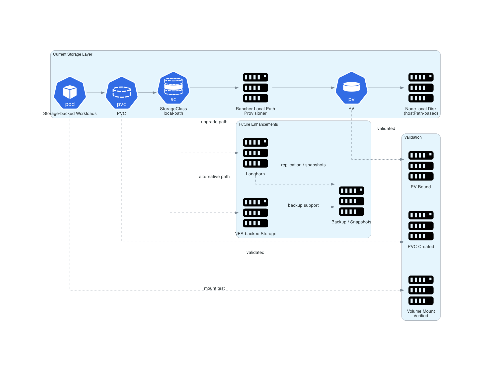

# Storage Design

## Storage Goals

- provide persistent volume support
- keep deployment simple for homelab
- enable storage-backed services such as Prometheus and databases later

## Current Storage Layer

- Rancher Local Path Provisioner
- dynamic provisioning via `local-path` storage class

## Validation

- PVC creation succeeded
- PV binding succeeded
- pod volume mount tested successfully

## Future Storage Enhancements

- Longhorn
- NFS-backed storage
- backup snapshots

## Diagram

